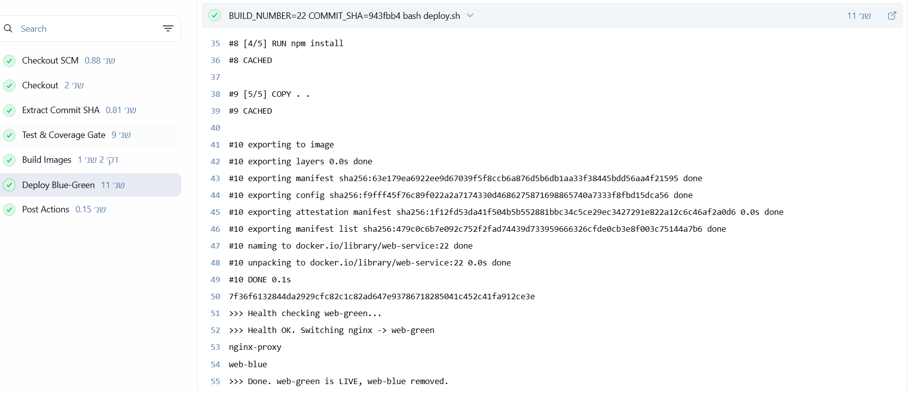
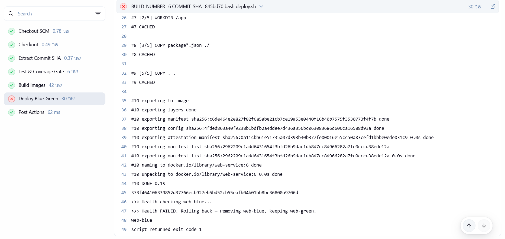
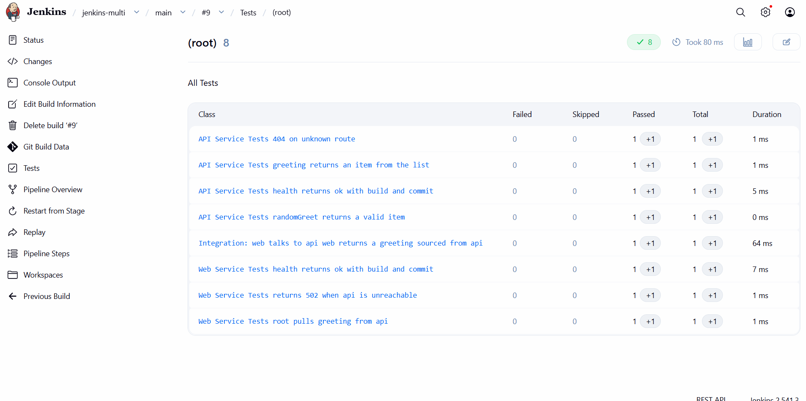

<div dir="rtl">

# קו CI/CD לשני שירותים ב-Jenkins עם פריסה כחול־ירוק

מטלת סיום — אינטגרציה רציפה ופריסה עם Jenkins, Docker ו-nginx.

הפרויקט מקים קו CI/CD מלא לשני שירותים (`api` ו-`web`) הרצים ברשת דוקר פנימית, כולל בדיקות אוטומטיות, שער כיסוי, בנייה, סריקה, ופריסה כחול־ירוק (Blue-Green) ללא זמן השבתה — הכול מנוהל אוטומטית דרך Jenkins Multibranch Pipeline.

---

## תוכן עניינים

1. [ארכיטקטורה](#ארכיטקטורה)
2. [מבנה הפרויקט](#מבנה-הפרויקט)
3. [השירותים](#השירותים)
4. [קו ה-Pipeline](#קו-ה-pipeline)
5. [שער כיסוי הבדיקות](#שער-כיסוי-הבדיקות)
6. [התנהגות לפי ענף](#התנהגות-לפי-ענף)
7. [פריסה כחול־ירוק](#פריסה-כחולירוק)
8. [מבחן החבלה](#מבחן-החבלה)
9. [בונוס: דוח בדיקות בממשק](#בונוס-דוח-בדיקות-בממשק)
10. [איך מריצים](#איך-מריצים)
11. [צילומי מסך להגשה](#צילומי-מסך-להגשה)
12. [רפלקציה אישית](#רפלקציה-אישית)

---

## ארכיטקטורה

המערכת בנויה משני שירותים שמתקשרים ברשת דוקר פנימית, מאחורי שער כניסה של nginx שמאפשר את הפריסה הכחול־ירוקה.

```
                      [ nginx-proxy ]   ← שער כניסה על הפורט הקבוע 8080
                            │
                   מצביע כרגע על אחד מ:
                        ┌───┴────┐
                  [ web-blue ]  [ web-green ]   ← רק אחד פעיל; השני עולה בזמן פריסה
                        │
                     [ api ]    ← שירות הנתונים, ברשת הפנימית בלבד (פורט 3000)
```

- **nginx-proxy** — יושב על הפורט החיצוני הקבוע (8080). בזמן פריסה מחליף את ה-`upstream` שלו לגרסה החדשה בטעינה חלקה, בלי שהאתר יורד לרגע.
- **web-blue / web-green** — שתי גרסאות של שירות התצוגה. בכל רגע נתון רק אחת מהן חיה; השנייה עולה לצידה בזמן פריסה ונבדקת לפני החלפת התעבורה.
- **api** — שירות הנתונים, חשוף רק ברשת הפנימית. `web` פונה אליו בשם השירות (`http://api:3000`), לא ב-localhost.
- כל הקונטיינרים מחוברים לרשת דוקר משותפת בשם `app-network`.
- **Jenkins** רץ כקונטיינר עם גישה ל-`docker.sock` של המארח (Docker-outside-of-Docker), כך שכל פקודות הבנייה והפריסה מבוצעות על אותו daemon.

---

## מבנה הפרויקט

```
jenkins/
├── api/                        # שירות הנתונים
│   ├── app.js                  # שרת HTTP: /health, /greeting
│   ├── Dockerfile              # מזריק BUILD_NUMBER + COMMIT_SHA
│   ├── package.json
│   └── tests/                  # בדיקות יחידה (jest)
├── web/                        # שירות התצוגה
│   ├── app.js                  # /health + משיכת ברכה מ-api
│   ├── Dockerfile
│   ├── package.json
│   └── tests/                  # בדיקות יחידה + בדיקת אינטגרציה
├── nginx/
│   └── default.conf            # תצורת ה-reverse proxy
├── jenkins/                    # סביבת ה-Jenkins עצמה
│   ├── Dockerfile              # Jenkins + Docker CLI + Node 20
│   └── docker-compose.yml      # ממפה docker.sock, פורט 9090
├── deploy.sh                   # לוגיקת הפריסה הכחול־ירוקה
├── Jenkinsfile                 # הגדרת קו ה-CI/CD
└── README.md
```

---

## השירותים

### api — שירות הנתונים

שרת HTTP פשוט שמחזיר JSON בלבד:

- **`GET /health`** → `{ "status": "ok", "build": <מספר בנייה>, "commit": <7 תווי קומיט> }`
  חותמת הבנייה מוזרקת מ-Jenkins דרך משתני סביבה (`BUILD_ID`, `COMMIT_HASH`) שנקבעים ב-Dockerfile.
- **`GET /greeting`** → `{ "greeting": <ברכה אקראית> }`
  זהו מקור הנתונים ש-`web` מושך ממנו.

### web — שירות התצוגה

- **`GET /health`** → אותה חותמת בנייה (`status`, `build`, `commit`). הנתיב **עצמאי בכוונה** ואינו תלוי ב-api — הפרדה זו חשובה למבחן החבלה.
- **כל שאר הבקשות** → מושך ברכה מ-api דרך `API_URL` (שם השירות ברשת הפנימית) ומחזיר `{ "status": "ok", "message": <הברכה>, "source": "api" }`. אם api לא זמין, מוחזר `502`.

חותמת הבנייה ב-`/health` היא זו שמנגנון הפריסה הכחול־ירוק משתמש בה כדי לזהות איזו גרסה חיה כרגע.

---

## קו ה-Pipeline

קו ה-CI/CD מוגדר ב-`Jenkinsfile` (Declarative Pipeline) ורץ כ-**Multibranch Pipeline** — Jenkins מזהה אוטומטית את הענפים `dev` ו-`main` ומריץ בנייה נפרדת לכל אחד.

| שלב                      | תיאור                                                               |
| ------------------------ | ------------------------------------------------------------------- |
| **Checkout**             | משיכת הקוד מהמאגר                                                   |
| **Extract Commit SHA**   | חילוץ 7 התווים הראשונים של מזהה הקומיט לחותמת הבנייה                |
| **Test & Coverage Gate** | הרצת בדיקות היחידה בשני השירותים ואכיפת שער כיסוי של 80%            |
| **Build Images**         | בניית תמונות הדוקר לשני השירותים עם החדרת חותמת הבנייה (רץ בכל ענף) |
| **Deploy Blue-Green**    | פריסה כחול־ירוקה דרך `deploy.sh` — **רק בענף `main`**               |

בסיום כל בנייה, שלב `post` אוסף את דוחות הבדיקות (`junit`) ומציג אותם בממשק.

---

## שער כיסוי הבדיקות

כל שירות מריץ `jest` עם אכיפת סף כיסוי:

```
jest --coverage --coverageThreshold='{"global":{"lines":80}}'
```

אם כיסוי השורות יורד מתחת ל-80%, הבדיקות נכשלות, והבנייה נעצרת באדום עוד לפני שלב הבנייה או הפריסה. כך מובטח שקוד לא-מכוסה מספיק אינו מגיע לאוויר.

---

## התנהגות לפי ענף

ההפרדה בין סביבת הפיתוח לסביבת הייצור מוגדרת בתנאי `when` על שלב הפריסה:

```groovy
stage('Deploy Blue-Green') {
    when {
        expression { env.BRANCH_NAME == 'main' || env.BRANCH_NAME == 'master' }
    }
    ...
}
```

- **ענף `dev`** — מריץ בדיקות ובנייה בלבד. שלב הפריסה **מדולג** (בלוג יופיע `Stage "Deploy Blue-Green" skipped due to when conditional`). כלומר: בודקים ובונים, אך לא מעלים לאוויר.
- **ענף `main`** — מריץ את התהליך המלא, כולל הפריסה הכחול־ירוקה לאוויר.

אותו קוד רץ בשני הענפים, אך ההתנהגות שונה לפי שם הענף.

---

## פריסה כחול־ירוק

הלב של הפרויקט — פריסה ללא זמן השבתה (`deploy.sh`). הרעיון: הגרסה החדשה עולה **לצד** הישנה, נבדקת, ורק אם היא בריאה — התעבורה מועברת אליה. אם היא נכשלת, הגרסה הישנה נשארת חיה.

הרצף שהסקריפט מבצע:

1. **זיהוי הצבע הפעיל** — בודק אם `web-blue` או `web-green` רץ כרגע, והצבע החדש הוא ההפוך.
2. **בניית והרצת הגרסה החדשה** לצד הישנה — הישנה ממשיכה לשרת, אפס זמן השבתה.
3. **בדיקת בריאות** מול הגרסה החדשה בלבד (`/health`).
4. **אם עברה** → מעדכן את nginx להצביע על החדשה, מבצע טעינה חלקה (`SIGHUP`), ומכבה את הישנה.
5. **אם נכשלה** → מוחק את הגרסה החדשה, הישנה נשארת חיה, והבנייה נצבעת באדום (`exit 1`).

> 📸 **צילום מס' 1 — בנייה ירוקה מלאה**
> צלם בנייה מוצלחת של `main` שבה שלב `Deploy Blue-Green` רץ בירוק והחליף בהצלחה את הגרסה. בלוג הפריסה יופיע `Health OK. Switching nginx` ו-`is LIVE`.
>
> ``

---

## מבחן החבלה

קו ה-Pipeline נבנה כך שכל תקלה נעצרת בשלב הנכון ונצבעת באדום. חמישה תרחישים אפשריים:

| תרחיש                    | הזרעה                                   | היכן נעצר                            |
| ------------------------ | --------------------------------------- | ------------------------------------ |
| **א' — שבירת בדיקה**     | בדיקה מחזירה תוצאה שגויה                | שלב הבדיקות                          |
| **ב' — הורדת כיסוי**     | קוד לא-מכוסה מוריד את הכיסוי מתחת ל-80% | שער הכיסוי                           |
| **ג' — health שבור**     | נתיב `/health` מחזיר שגיאה              | הפריסה הכחול־ירוקה מזהה ומבצעת החזרה |
| **ד' — כתובת api שבורה** | web פונה לכתובת api שגויה               | בדיקת האינטגרציה                     |
| **ה' — Dockerfile שבור** | שגיאת תחביר ב-Dockerfile                | שלב הבנייה                           |

> 📸 **צילום מס' 2 — בנייה שנעצרה באדום**
> צלם תרחיש חבלה שבו הבנייה נעצרת ונצבעת אדום (למשל תרחיש א' או ב' — נעצר ב-`Test & Coverage Gate`, ושלבי הבנייה והפריסה מדולגים).
>
> ``

> 📸 **צילום מס' 3 — החזרה אוטומטית לגרסה קודמת**
> צלם את לוג שלב `Deploy Blue-Green` בתרחיש ג', שבו רואים `Health FAILED. Rolling back` — הגרסה החדשה נמחקת, הישנה נשארת חיה.
>
> ``

---

## בונוס: דוח בדיקות בממשק

במקום לחפש תוצאות בדיקות בתוך הלוג, הן מוצגות בטאב ייעודי בממשק Jenkins. מושג באמצעות `jest-junit` שמייצר דוח בפורמט JUnit XML, ושלב `junit` ב-Jenkinsfile שאוסף ומציג אותו:

```groovy
post {
    always {
        junit '**/junit.xml'
    }
}
```

התוצאה: טאב **Test Result** בעמוד הבנייה, עם טבלת בדיקות מסודרת וגרף מגמת בדיקות.

> 📸 **בונוס — דוח בדיקות בממשק**
> צלם את טאב ה-Test Result עם טבלת הבדיקות בממשק.
>
> ``

---

## איך מריצים

**הרמת סביבת Jenkins:**

```bash
cd jenkins
docker compose up -d
cd ..
```

Jenkins יהיה זמין על פורט **9090**.

**הרמת תשתית האפליקציה** (רשת + api + web-blue + nginx):

```bash
docker network create app-network

docker build -t api-service ./api
docker run -d --name api --network app-network -e PORT=3000 api-service

docker build -t web-service:v1 ./web
docker run -d --name web-blue --network app-network \
  -e PORT=8080 -e API_URL=http://api:3000 web-service:v1

docker run -d --name nginx-proxy --network app-network -p 8080:80 nginx:alpine
docker cp nginx/default.conf nginx-proxy:/etc/nginx/conf.d/default.conf
docker restart nginx-proxy
```

**בדיקה:**

```bash
curl http://localhost:8080/          # ברכה עם "source":"api"
curl http://localhost:8080/health    # חותמת בנייה
```

**הגדרת ה-Pipeline ב-Jenkins:** New Item → Multibranch Pipeline → Git source עם כתובת המאגר → Script Path: `Jenkinsfile`.

---

## צילומי מסך להגשה







> 📸 **צילום מס' 4 — שני ענפים**
> צלם את עמוד ה-Multibranch Pipeline שבו רואים את שני הענפים (`dev` ו-`main`) עם היסטוריות בנייה נפרדות.

**קישור למאגר:** `https://github.com/alemusee-cmd/jenkins`

---

## רפלקציה אישית

השלב המאתגר ביותר עבורי בפרויקט היה סעיף 5 — הפריסה הכחול־ירוקה (Blue-Green). בניגוד לשאר חלקי המטלה שנשענו על חומר שכבר הכרתי, הנושא הזה היה חדש לגמרי ולא נלמד במהלך הקורס. בהתחלה אפילו לא היה לי ברור מה בדיוק נדרש — לקח לי זמן רב רק להבין את העיקרון עצמו: להעלות גרסה חדשה לצד הישנה, לבדוק שהיא תקינה, ורק אז להעביר אליה את התעבורה בלי שהשירות יירד ולו לרגע. נאלצתי לחפש מקורות הסבר בעצמי, לקרוא על nginx כשער כניסה ועל בדיקות בריאות, ולנסות כמה גישות עד שהבנתי איך לזהות איזו גרסה פעילה, איך להחליף את הגדרת ה-nginx בטעינה חלקה, ואיך לבנות מנגנון החזרה (rollback) שמשאיר את הגרסה הישנה חיה כשהחדשה נכשלת. הדרך הייתה מלווה בהרבה ניסוי וטעייה — התמודדתי עם בעיות כמו טעינה מחדש של nginx בתוך קונטיינר והתנגשויות פורטים — אבל דווקא משום שהחומר היה חדש ולא מוכר, זה גם השלב שממנו למדתי הכי הרבה, וזה שנתן לי את ההבנה העמוקה ביותר על מה באמת עומד מאחורי פריסה ללא זמן השבתה.

</div>
